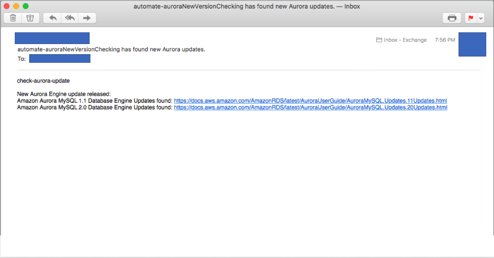

## Automated checking for new Aurora engine update releases.

Python Lambda module for checking new Aurora Engine update releases.



## License Summary

This sample code is made available under a modified MIT license. See the LICENSE file.

## AWS Costs
AWS Lambda Invocation (Usually Free https://aws.amazon.com/free/)  
Amazon SES (Usually Free https://aws.amazon.com/free/)  
Minimal Amazon S3 Usage  

## Prerequisites
awscli - https://aws.amazon.com/cli/  

configure AWS credentials for target account  
`aws configure` 

Verified Amazon SES Sender email  
https://docs.aws.amazon.com/ses/latest/DeveloperGuide/verify-email-addresses.html  
If you verify an email, you can send from/to that address.
To send to other addresses, you need to move SES out of sandbox mode:  
https://docs.aws.amazon.com/ses/latest/DeveloperGuide/request-production-access.html  
 
Docker (optional for building the lambda python package with updated https://pypi.python.org/ third-party libraries)

## Building
Run build.sh to build a new lambda deployment package.
This requires Docker, as it builds the package in an Amazon Linux container.

`sh build.sh`

## Deploying (SAM / Script)
Update the values in deploy.sh for your AWS account details.  
CONFIG_BUCKET: S3 Bucket to use for storing configuration file  
CONFIG_FILE: Configuration file name  
BUCKET: Bucket for -  
 1. Keeping previous Aurora Engine updates doc page (https://docs.aws.amazon.com/AmazonRDS/latest/AuroraUserGuide/AuroraMySQL.Updates.html) sha1 fingerprints.

And then run deploy.sh

`sh deploy.sh`

## Deploy Manually (Lambda Console)
1. Create a lambda function (python 3.6 runtime)
2. Create a lambda IAM execution role with ses:, s3:, organizations:DescribeAccount:
3. Upload zip to console from lambda.zip produced by running 'build.sh'.
4. Update ENV Variables in Lambda console  
   CONFIG_BUCKET: S3 Bucket to use for storing configuration file  
   CONFIG_FILE: Configuration file name  
   BUCKET: Bucket for storing previous SHA1 fingerprints for comparison.
5. Create a trigger (CloudWatch Event)

## Manually Running / Testing
Once the lambda is created, find it in the AWS Lambda console.\
You can create the following test event to test a fake previous site (test11.htm, test20.htm) against the current Aurora Doc for simulating new Aurora update release event. \
Any other event content is ignored and defaults into checking against the real site.
```json
{
"test": "True"
}
```

https://docs.aws.amazon.com/lambda/latest/dg/tutorial-scheduled-events-test-function.html

## Customize the settings
Edit the contents of src/config.yaml

```yaml
# SES settings
ses_region: "us-east-1"
ses_from: "changeme@domain.com" # Sender
ses_send: "changeme@domain.com" # Recipient list separated by comma

# Log Configuration File.
log_config: "log_config.yaml"

# Email template for sending blocked IP found notification.
email_template: "check-aurora-update\n\n
New Aurora Engine update released: \n
{0}{1}\n\n"
```
